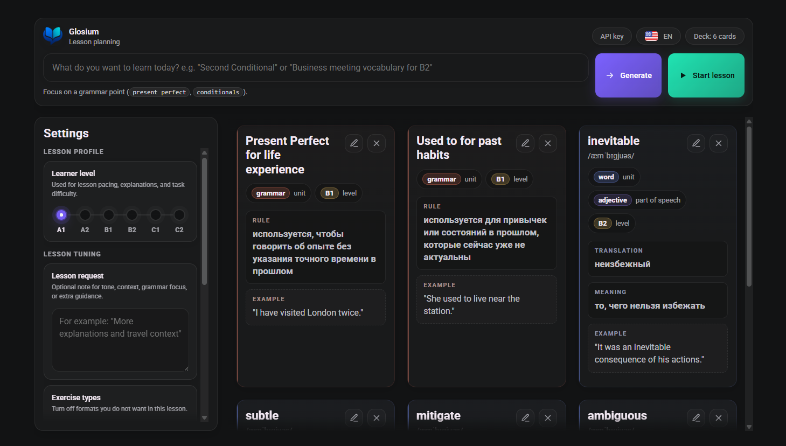
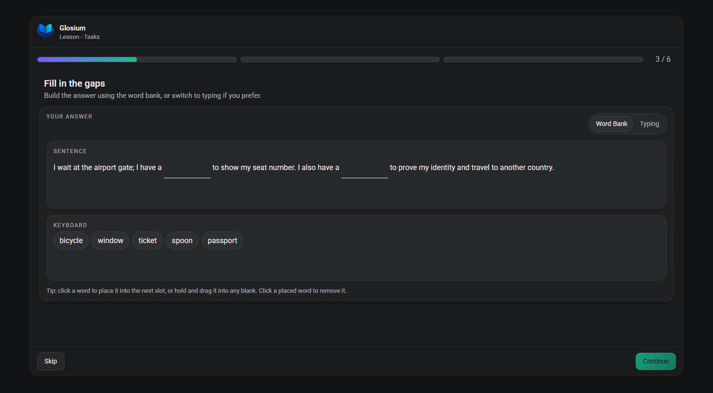

# Glosium

Glosium is a web page for generating AI-assisted languages lessons from your request.

## Screenshots

<table>
  <tr>
    <td width="50%">
      
    </td>
    <td width="50%">
      
    </td>
  </tr>
  <tr>
    <td align="center"><sub>Lesson planning screen.</sub></td>
    <td align="center"><sub>Lesson task screen.</sub></td>
  </tr>
</table>

## Requirements

- Node.js 20 or newer
- An OpenRouter API key

## Run Locally

```bash
npm install
npm run dev
```

Open the URL printed by Vite, usually `http://127.0.0.1:5173/`.

## API Key

This prototype reads the OpenRouter key from browser `localStorage` under:

```text
openrouter_api_key
```

Use the included local storage utility at `/storage.html` to create or update that value for the current origin. The app links to this utility from the setup screen.

## Development Mode

Pipeline debug stubs live in `src/pipeline/stubs.js`. You can enable them, so exercise content can be tested without spending API calls.

## Notification API

Use `notify` from `src/ui/notifications.js`, or call the global
`window.glosiumNotify` API from any screen:

```js
import { notify } from "./ui/notifications.js";

notify.debug("Generation stream chunk received.");
notify.info("Lesson is ready.");
notify.warning("Add a lesson request first.");
notify.error("Could not generate cards.");
```

The API also supports `notify.show({ level, title, message, duration })`,
`notify.close(id)`, and `notify.clear()`.

## License

GPL-3.0-only. See [LICENSE](LICENSE).
